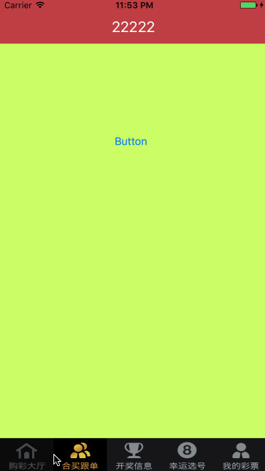

## XNTabbar

自定义tabbar. 

2年前写的一篇文章, 发现这个例子下载的人比较多, 于是整理了代码, 做了下适配. (Xcode8, iOS10)

文章链接: [http://blog.csdn.net/xn4545945/article/details/35994863](http://blog.csdn.net/xn4545945/article/details/35994863)

